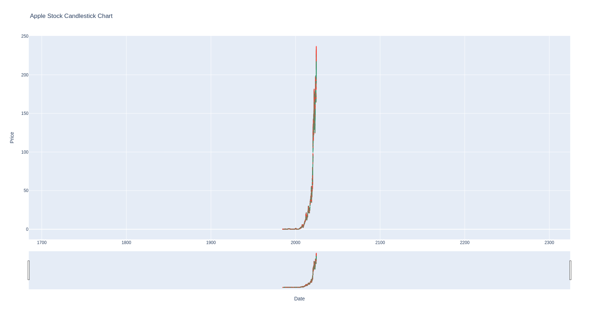
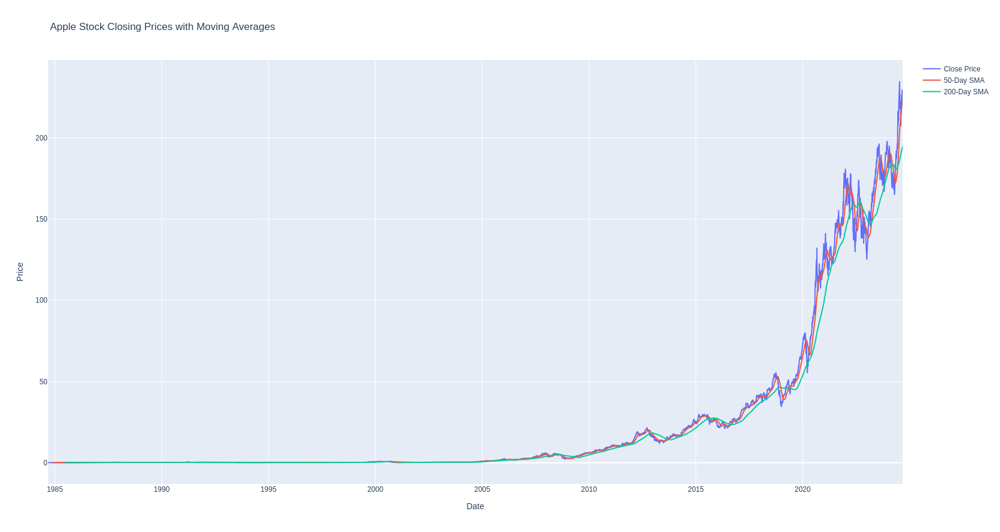

# Apple Stock Data Analysis

## Example Plots

### New Plot 1

### New Plot

## Overview

This project involves analyzing historical Apple stock data to visualize trends, calculate moving averages, and identify patterns. The analysis is performed using Python, with visualizations created using Matplotlib and Plotly. The dataset spans from 1984 to 2024 and includes daily stock prices and trading volume.

## Project Structure

- `aapl_stock_analysis.py`: The main Python script that performs data analysis and generates visualizations.
- `aapl_us_d.csv`: The CSV file containing Apple stock data from 1984 to 2024.

## Features

- **Basic Visualization**: Plots the closing prices of Apple stock over time.
- **Moving Averages**: Calculates and plots 50-day and 200-day simple moving averages.
- **Trendline**: Fits and visualizes a linear trendline to the closing prices.
- **Interactive Visualizations**: Creates interactive line and candlestick charts using Plotly.
- **Volume Analysis**: Plots trading volumes over time.
- **Correlation Analysis**: Computes and displays the correlation matrix of key stock data columns.

## Requirements

To run this project, you need to have the following Python packages installed:

- `pandas`
- `matplotlib`
- `plotly`
- `scipy`

You can install these packages using pip:

## bash
pip install pandas matplotlib plotly scipy

  
